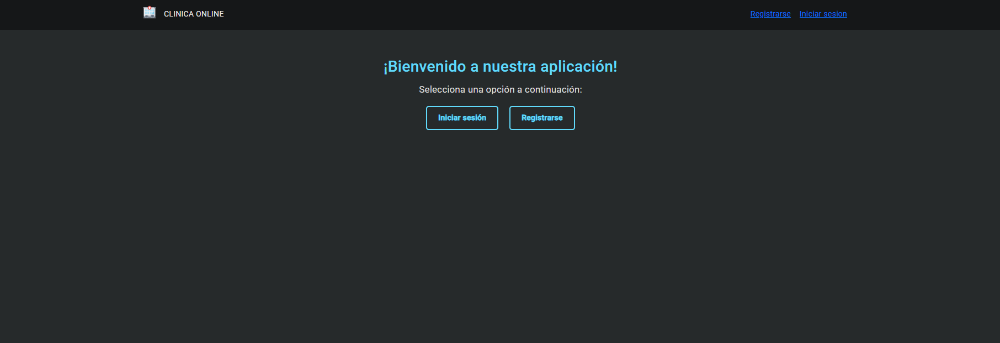
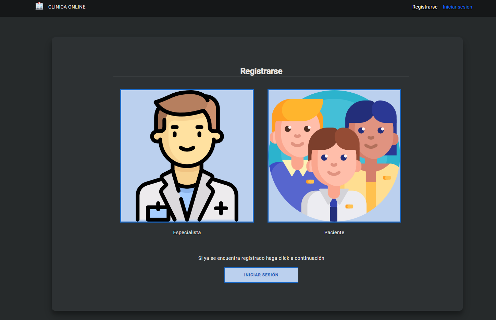
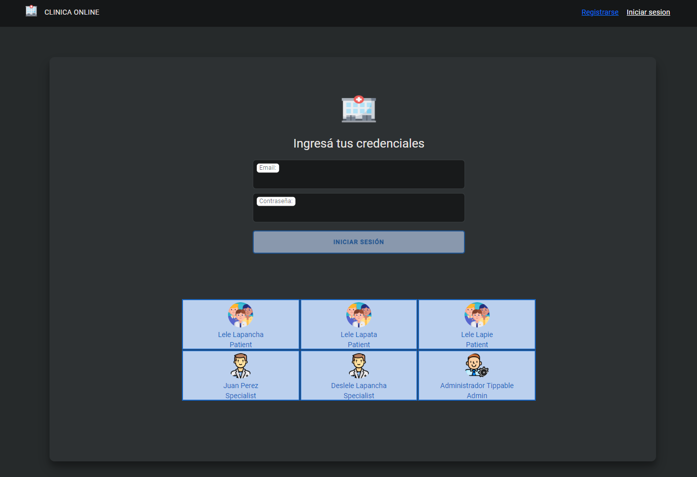
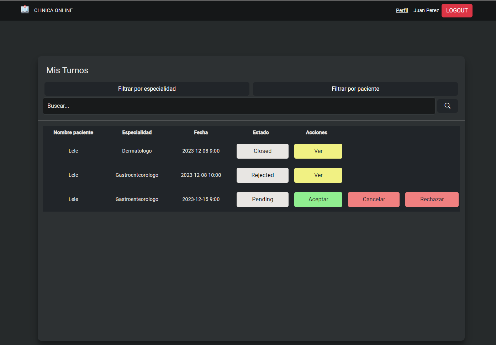
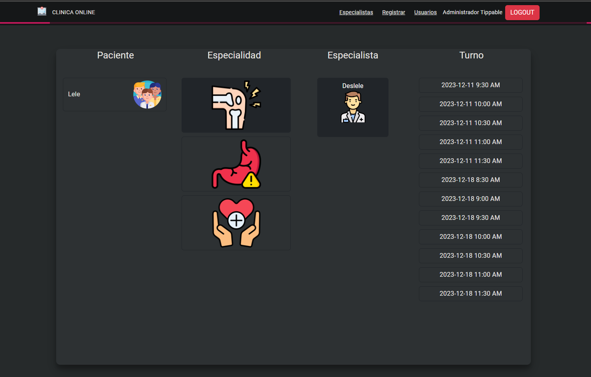
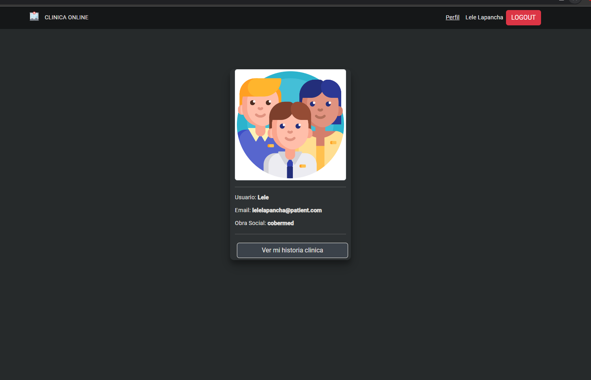
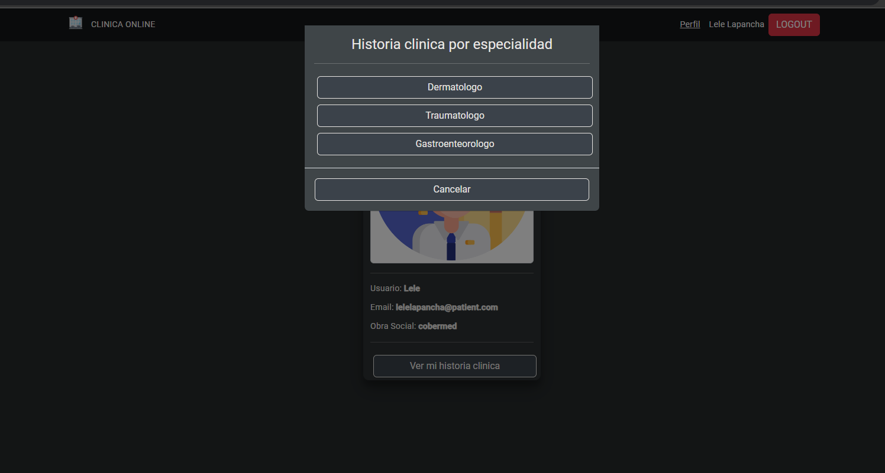
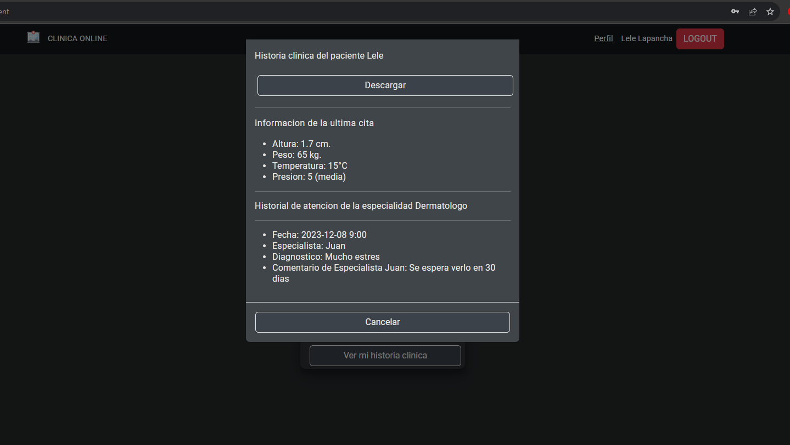

# Sistema de Gestión de Clínica

Bienvenido al repositorio del sistema de gestión de la Clínica Online. Esta aplicación agiliza las operaciones de una clínica de salud, ofreciendo funciones para el registro de usuarios, programación de citas y atención integral al paciente. A continuación, se presenta una breve descripción de las funcionalidades del sistema:

## Sprint 1: Gestión de Usuarios

- **Página de Bienvenida**: Acceso rápido a inicio de sesión y registro.
  

- **Registro**: Pacientes y Especialistas pueden registrarse con detalles relevantes.
  

- **Inicio de Sesión**: Autenticación segura con acceso específico según el rol.
  

- **Sección de Usuarios**: Los administradores pueden ver información de usuarios, habilitar/deshabilitar el acceso de Especialistas y crear nuevos usuarios.

## Sprint 2: Manejo de Citas

- **Mis Citas (Paciente)**: Ver y gestionar citas programadas.
- **Acciones de Citas**: Pacientes y Especialistas pueden cancelar, revisar, completar encuestas y calificar citas.
- **Turnos (Admin)**: Los administradores pueden ver y gestionar citas en toda la clínica, cancelar y filtrar según diversos criterios.

Paciente

Especialista

Admin

## Sprint 3: Historial del Paciente

- **Perfiles de Pacientes**: Perfiles de pacientes incluyen datos fijos y registros de salud dinámicos.
- **Creación de Historial (Especialista)**: Especialistas pueden agregar registros de salud después de las consultas.
- **Exportar Informes**: Los administradores pueden descargar datos de usuarios (Excel) e historiales de salud de pacientes (PDF).

## Sprint 4: Análisis y Reportes

- **Registro de Usuarios**: Seguimiento de ingresos de usuarios con marca de tiempo.
- **Estadísticas de Citas**: Visualización de datos de citas por especialidad y día.
- **Descarga de Reportes**: Exportar análisis en formato Excel o PDF.

## Sprint 5: Datos de Salud Dinámicos

- **Nuevos Datos de Salud**: Especialistas pueden ingresar datos con controles específicos.
- **Captcha Personalizado**: Directiva de captcha única para entrada segura de datos.
- **Animaciones**: Implementar seis animaciones de transición para una experiencia de usuario más fluida.

## Sprint 6: Soporte Multilingüe y Encuestas

- **Interfaz de Usuario Multilingüe**: Elija entre inglés, español y portugués.
- **Encuestas para Pacientes**: Recopile comentarios de pacientes con diversas preguntas.
- **Informes Estadísticos**: Genere informes sobre visitas a la clínica, recuentos de pacientes y médicos, y respuestas de encuestas.

Siéntase libre de explorar las diversas secciones y funcionalidades. Consulte el [Wiki](enlace al wiki) para obtener documentación detallada sobre cada función. Para cualquier problema o consulta, utilice la sección [Issues](enlace a Issues).

¡Gracias por contribuir al éxito de la Clínica Online! 🏥💻
